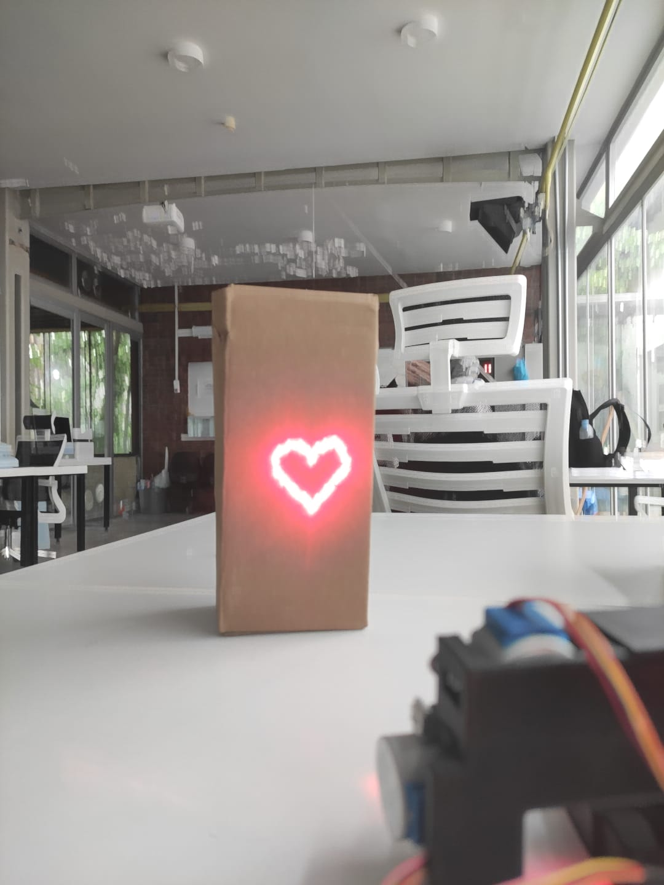
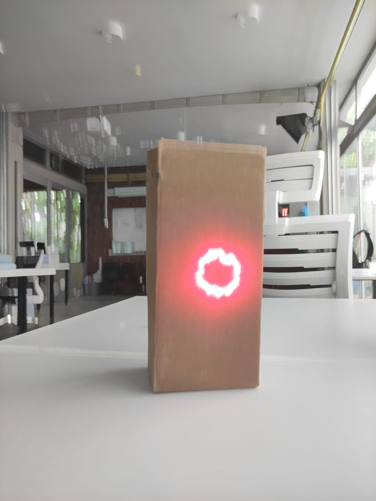
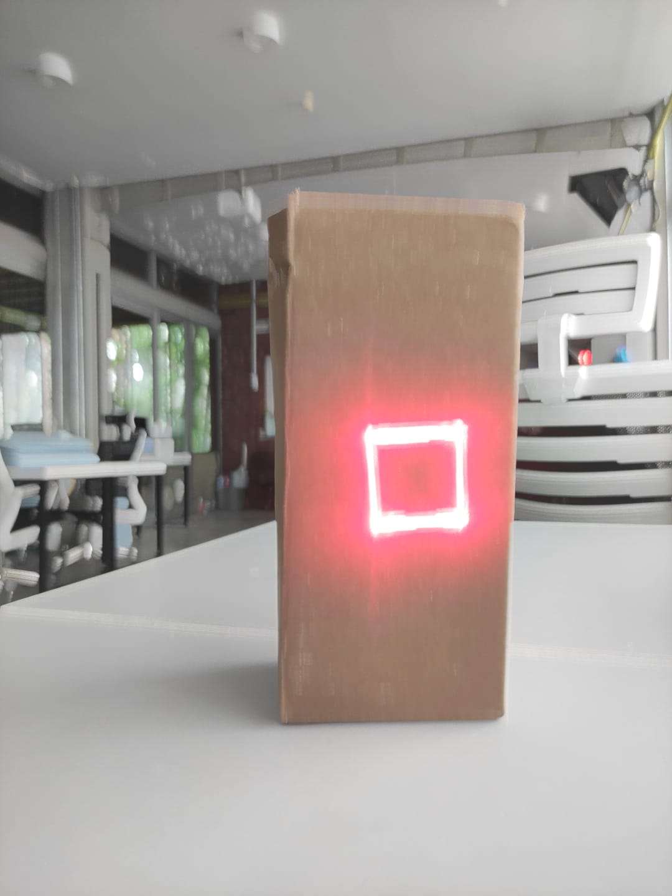
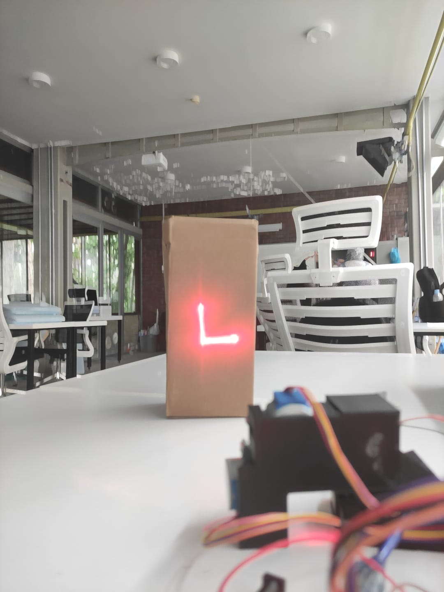
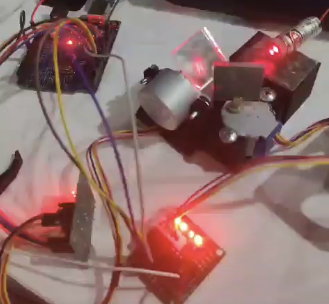

# DIY Laser XY Scanner

A low-cost DIY laser XY scanner built using Arduino, dual stepper motors, and custom control algorithms.

This project can draw geometric shapes and characters using a laser beam and two-axis mirror movement controlled by stepper motors.

---

# Project Preview

## Heart Shape

<p align="center">
  
</p>

## Circle

<p align="center">
  
</p>

## Square

<p align="center">
  
</p>

## L Character

<p align="center">
  
</p>

---

# System Overview

<p align="center">
  
</p>

The system uses two stepper motors with mirrors attached to create X-Y laser movement.

The laser remains continuously ON while the mirrors redirect the beam to generate shapes.

---

# 3D Design Reference

The mechanical structure was inspired by the following open-source project:

- Instructables Project:  
https://www.instructables.com/Low-Cost-DIY-Stepper-Motor-Laser-XY-Scanner-Cutter/

The following 3D design references were used as inspiration:

<p align="center">
  
  
  
</p>

I only used the mechanical/3D design idea as a reference.

All software, motion logic, serial communication structure, drawing algorithms, and shape generation code were fully written and redesigned by me.

---

# Features

- Dual-axis laser scanner
- Real-time shape drawing
- Arduino-based motion control
- Python serial controller
- Manual WASD movement
- Adjustable speed and shape size
- Low-cost design
- Beginner-friendly hardware

---

# Shapes Supported

- Square
- Circle
- Heart
- L Character
- V Character
- A Character

---

# Hardware Used

| Component | Quantity |
|---|---|
| Arduino Uno/Nano | 1 |
| 28BYJ-48 Stepper Motor | 2 |
| ULN2003 Driver Board | 2 |
| Laser Module | 1 |
| Mirrors | 2 |
| 3D Printed Parts | 1 Set |

---

# Software

## Arduino

Language:
- C++

Library:
- AccelStepper

Install from Arduino Library Manager.

---

## Python

Required library:

```bash
pip install pyserial
```

---

# Controls

| Command | Action |
|---|---|
| w | Move Up |
| s | Move Down |
| a | Move Left |
| d | Move Right |
| m | Save Center |
| 1 | Draw Square |
| 2 | Draw Circle |
| 3 | Draw Heart |
| 4 | Draw A |
| 5 | Draw L |
| 6 | Draw V |
| x | Stop |

---

# How It Works

The system redirects a laser beam using two mirrors attached to stepper motors.

Each motor controls one axis:

- X axis
- Y axis

The Arduino calculates target coordinates and continuously updates motor positions to generate visible laser shapes.

Unlike expensive galvo scanners, this project uses low-cost stepper motors and simple electronics.

---

# Future Improvements

- SVG drawing support
- G-code support
- Laser TTL control
- Faster scanning
- Galvo mirror upgrade
- Image drawing support
- Wireless control
- Mobile application
- Real-time drawing interface

---

# Safety Warning

This project uses a laser diode.

Avoid direct eye exposure and always follow proper laser safety precautions.

---

# License

This project is open-source.

Please provide proper attribution if you use or modify this project.
